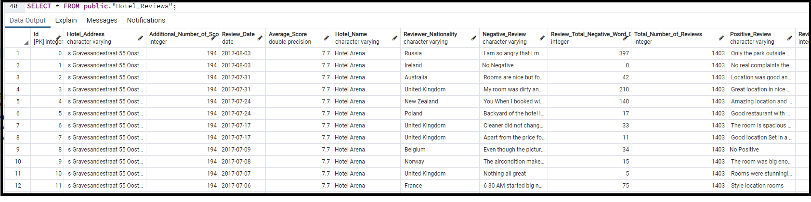
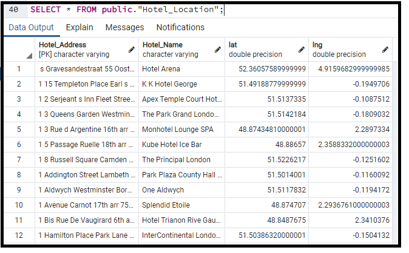
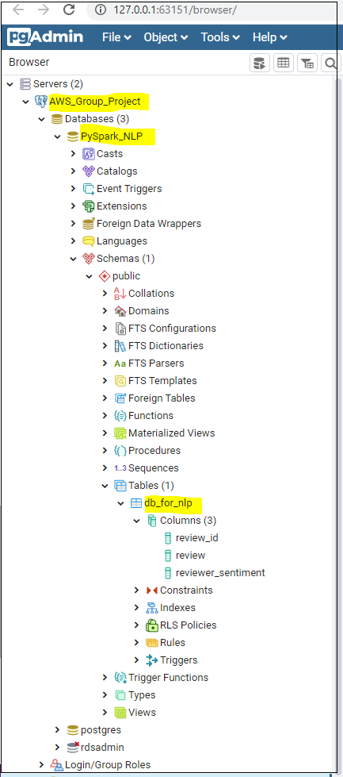

# Storing tables in Database

## Part 1: PostgreSQL
Step 1: Create the ERD diagrams using [QuickDBD](https://www.quickdatabasediagrams.com/)


Step 2: Create Schemas using [QuickDBD](https://www.quickdatabasediagrams.com/)
```
-- Exported from QuickDBD: https://www.quickdatabasediagrams.com/
-- NOTE! If you have used non-SQL datatypes in your design, you will have to change these here.


CREATE TABLE "Hotel_Reviews" (
    "Id" int   NOT NULL,
    "Hotel_Address" varchar   NOT NULL,
    "Additional_Number_of_Scoring" int   NOT NULL,
    "Review_Date" date   NOT NULL,
    "Average_Score" float   NOT NULL,
    "Hotel_Name" varchar   NOT NULL,
    "Reviewer_Nationality" varchar   NOT NULL,
    "Negative_Review" varchar   NOT NULL,
    "Review_Total_Negative_Word_Counts" int   NOT NULL,
    "Total_Number_of_Reviews" int   NOT NULL,
    "Positive_Review" varchar   NOT NULL,
    "Review_Total_Positive_Word_Counts" int   NOT NULL,
    "Total_Number_of_Reviews_Reviewer_Has_Given" int   NOT NULL,
    "Reviewer_Score" float   NOT NULL,
    "Tags" varchar   NOT NULL,
    "days_since_review" varchar   NOT NULL,
    CONSTRAINT "pk_Hotel_Reviews" PRIMARY KEY (
        "Id"
     )
);

CREATE TABLE "Hotel_Location" (
    "Hotel_Address" varchar   NOT NULL,
    "Hotel_Name" varchar   NOT NULL,
    "lat" float   NOT NULL,
    "lng" float   NOT NULL,
    CONSTRAINT "pk_Hotel_Location" PRIMARY KEY (
        "Hotel_Address"
     )
);

ALTER TABLE "Hotel_Reviews" ADD CONSTRAINT "fk_Hotel_Reviews_Hotel_Address" FOREIGN KEY("Hotel_Address")
REFERENCES "Hotel_Location" ("Hotel_Address");
```

Step 3: Import the tables into PostgreSQL

Step 4: View Table 1



Step 5: View Table 2



Step 6: Join the 2 tables
```
-- Joining the 2 tables into 1 table 
create table "Hotel_reviews_and_locations_combined_table" AS
SELECT 
	public."Hotel_Reviews"."Id",
	public."Hotel_Reviews"."Hotel_Address",
	public."Hotel_Reviews"."Additional_Number_of_Scoring",
	public."Hotel_Reviews"."Review_Date",
	public."Hotel_Reviews"."Average_Score",
	public."Hotel_Reviews"."Hotel_Name",
	public."Hotel_Reviews"."Reviewer_Nationality",
	public."Hotel_Reviews"."Negative_Review",
	public."Hotel_Reviews"."Review_Total_Negative_Word_Counts",
	public."Hotel_Reviews"."Total_Number_of_Reviews",
	public."Hotel_Reviews"."Review_Total_Positive_Word_Counts",
	public."Hotel_Reviews"."Total_Number_of_Reviews_Reviewer_Has_Given",
	public."Hotel_Reviews"."Reviewer_Score",
	public."Hotel_Reviews"."Tags",
	public."Hotel_Reviews"."days_since_review",
	public."Hotel_Location"."lat",
	public."Hotel_Location"."lng"
from public."Hotel_Reviews"
left join public."Hotel_Location" ON public."Hotel_Reviews"."Hotel_Address" =public."Hotel_Location"."Hotel_Address";
```

Step 7: View the combined table


## Part 2: AWS RDS PostgreSQL database

Step1: Creating a PostgreSQL DB on AWS


Step2: Connecting the AWS RDS to local PgAdmin


