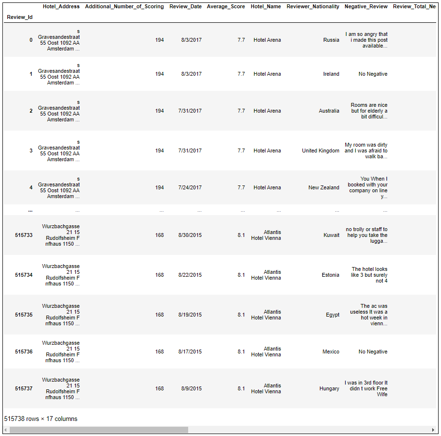
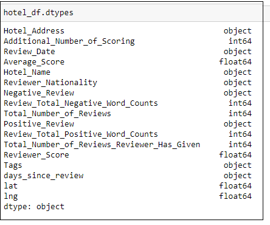
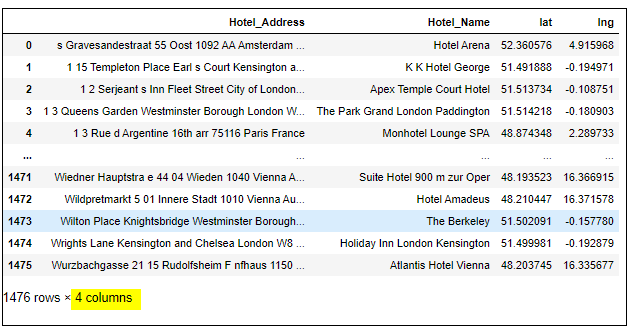
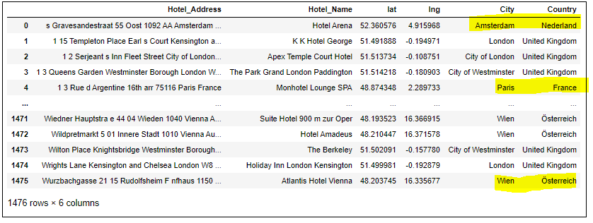

# Data PreProcessing

Step 1: Observe the source data - While observing the Source file: Hotel_Reviews.csv in a pandas DataFrame, 
- We found, it had 515738 rows × 17 columns 

- The 17 columns and corresponding data types were

    

Step 2: Since there was no unique column in the table, we used the pandas dataframe index to creae a unique column 'Review_Id' for working with data in PostgreSQL

`hotel_df.index.name='Review_Id`

Step 3: Remove null values
- Step 3a: Check for null/na values
- Step 3b: Drop rows that are na/null and reset the index from 0
- Step 3c: The operation above will delete the index name, so renaming it again as 'Review_Id'
- Step 3d: Check for null again
```
# check for null/na values
hotel_df.isnull().sum() 

# drop rows that are na/null and reset the index from 0
hotel_df = hotel_df.dropna().reset_index(drop=True) 

# the operation above will delete the index name, so renaming it again
hotel_df.index.name='Review_Id'

# check for null again
hotel_df.isnull().sum() 
```

Step 4: We found that, for best project efficiency, the 17 columns could be divided into two groups: 'review group' and 'location group' with the review group having information pertaining to reviews only, and the location group with information pertaining to location only.

Breaking the big table into 2 tables: 1st with hotel reviews, 2nd with hotel locations
- Step 4a: Create Table 1: Hotel reviews only - no location data (drop columns 'lat'and 'lng')
    ```
    # hotel reviws without lat and lng
    hotel_reviews = hotel_df.drop(columns=['lat','lng'])

    #view the table
    hotel_reviews
    ```
    

- Step 4b: Create Table 2: DF with locations (no reviews)
    ```
    # creating a subset of the dataframe with unique values on the column 'Hotel_Address' and then reset the index to 0
    unique_address_df = hotel_df.drop_duplicates(subset=['Hotel_Address']).reset_index(drop=True) 

    # view the table
    unique_address_df
    ```
    
    

- Step 4c: Select only 4 columns that we want - "Hotel_Address", "Hotel_Name", "lat", "lng"
    ```
    # selecting the ONLY 4 required columns
    hotel_location = unique_address_df[["Hotel_Address", "Hotel_Name", "lat", "lng"]]

    #view the table
    hotel_location
    ```
    

Step 5) Create sample tables with 1000 rows
- Step 5a: Table 1 - review table - selecting the first 1000 rows
    ```
    # creating a sample of table 2, with 1000 rows
    sample_of_hotel_location = hotel_location.loc[0:999]

    # view the table
    sample_of_hotel_location
    ```
    

- Step 5b: Table 2 - location table - selecting the first 1000 rows
    ```
    # creating a sample of table 1, with 1000 rows
    sample_of_hotel_reviews = hotel_reviews.loc[0:999]

    # view the table
    sample_of_hotel_reviews
    ```
    

Step 6) Extract city and country using lat and lng, using geopy
- Step 6a: Create 2 new columns for City and Country
    ```
    # creating 2 new columns
    hotel_location_city_country["City"] = ""
    hotel_location_city_country["Country"] = ""

    # view the df
    hotel_location_city_country
    ```
    

- Step 6b:Install GeoPy
    ```
    # install the module geopy
    ! pip install geopy

    # import module 
    from geopy.geocoders import Nominatim

    # initialize Nominatim API  
    geolocator = Nominatim(user_agent="geoapiExercises")
    ```

- Step 6c: Create a for loop to iterate through the rows, use the co-ordinates to pull the 'city' and 'county' and store them in the 'city' and 'country' columns
    ```
    # declare a variable to iterate over the rows
    i=0

    # loop for extracting city and county from the data using GeoPy
    for row in hotel_location_city_country.itertuples():
        Latitude = str(row.lat)
        Longitude = str(row.lng)
    
        location = geolocator.reverse(Latitude+","+Longitude) 
        address = location.raw['address'] 

        # traverse the data 
        city = address.get('city', '') 
        state = address.get('state', '') 
        country = address.get('country', '') 
        code = address.get('country_code') 
        zipcode = address.get('postcode') 

        print(f"Hotel {i+1}: Co-ordinates ({Latitude}, {Longitude}) | City: {city}, {country}")
        
        hotel_location_city_country.at[i, 'City'] = city
        hotel_location_city_country.at[i, 'Country'] = country
        i+=1

    # view the df
    hotel_location_city_country   
    ```
    

# Next Steps
At the end of each ipynb file, the new tables were stored in Zip files. 

The next step would be [**Storing the tables in Database**](https://github.com/JagpreetBath/European_Hotel_Analysis/tree/main/DataBase)