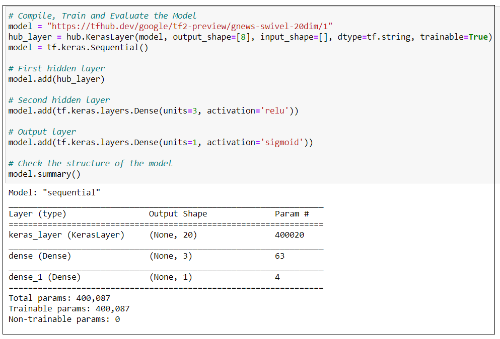
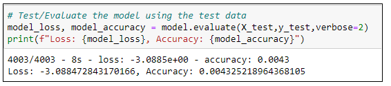

# Natural Language Processing (NLP)  - 2/2 
# NLP using Deep Learning (2 Layer Neural Network) 

## Resources
* Google Colab
* Model - tf2-preview/gnews-swivel-20dim
    * Model URL - https://tfhub.dev/google/tf2-preview/gnews-swivel-20dim/1

## Objective of this analysis

**This is NLP 2/2 - The first in the series was [PySpark NLP](https://github.com/JagpreetBath/European_Hotel_Analysis/blob/main/MachineLearning/ML_NLP_PySpark)**

**In the earlier analysis [PySpark NLP](https://github.com/JagpreetBath/European_Hotel_Analysis/blob/main/MachineLearning/ML_NLP_PySpark), we had used PySpark (Model = NaiveBayes) to do NLP, below were the results**
- For output as decimals (0.0 to 10.0): 20.77 %
- For output as integers (0 to 10): 39.62%
- For output as 5-star ratings (1 to 5): 61.27%
- For output as 3 Categories (Bad, Average, or Good): 77.63%
- For output as Sentiment (Positive or Negative): 91.56%

**In this analysis we will use DeepLearning (using 2 layers) to see if we can improve the accuracy at predicing the review output**

## 1: Using the input as `reviews` and output as `decimal score` (0.0 - 10.0)

## 2: Using the input as `reviews` and output as `integers` (0 - 10)

## 3: Using the input as `reviews` and output as 5 stars (1 - 5)

## 4: Using the input as `reviews` and output as `3 Categories` (Good, Average, Bad)

## 5: Using the input as `reviews` and output as `Sentiments` (Positive/Negative)

# Summary of Results
- For output as decimals (0.0 to 10.0): 0.0 %
- For output as integers (0 to 10): 0.0 %
- For output as 5-star ratings (1 to 5): 0.43 %
- For output as 3 Categories (Bad, Average, or Good): 3.10%
- For output as Sentiment (Positive or Negative): 95.66 %

# Suggestion
We found that this model is overfitted for review output as positive/negative. So if the company wants to predict reviewer sentiments, this is a very good model. It is, however, a big failure for predicting reviews in any other of the 4 formats - the PySpark NLP fares much better.

# BONUS

We saved the model so that it can be imported and tested by a user
[***Google Colab file to test the model***](https://github.com/JagpreetBath/European_Hotel_Analysis/tree/main/MachineLearning/ML_NLP_DeepLearning/Testing_the_model_with_user_input.ipynb)

[***Saved Model's .h5 file that needs to be placed at the same level as the Colab file above***](https://github.com/JagpreetBath/European_Hotel_Analysis/blob/main/MachineLearning/ML_NLP_DeepLearning/Step4_NLP_DL_Review_Pos_Neg_Format.ipynb)
