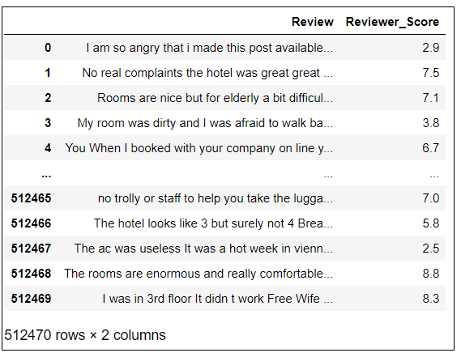
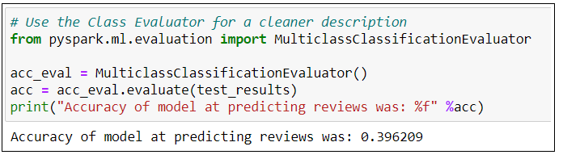
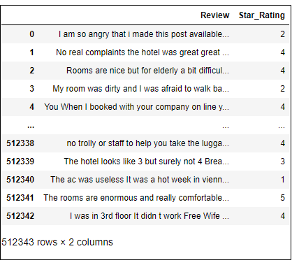

# Natural Language Processing (NLP) - 1/2 
## NLP using PySpark

## Resources
* Google Colab
* Libraries - PySpark
* Algorithm/Model used - NaiveBayes Classifier

## Objective
Analysts live by the saying 'the devil is in the details'. They would absolutely love a review score to be as detailed as possible - knowing if a score is 7.5, 8.5, or 9.5 is way better than knowing that a review is simply 'positive.

A very detailed review score, however, can pose a big challange in front of a Machine Leaning engineer, who wants to create a model to predict review score using review text as input. No ML engineer would want to show that their model has a very low accuracy - to increase the accuracy, he might want less number of possible outcomes.

The objective of this analysis is to find a middle ground between the loss of detail and accuracy of the model in predecting the outcome.

### Initial thoughts and strategy
* The data has 16 columns and 512,470 rows
* There are 2 different columns for reviews: 'Positive reviews' and 'Negative Reviews'
* The column 'Positive reviews' has many entries as 'No Positive'
* The column 'Negative reviews' has many entries as 'No Negative'

### Strategy
* Dropped 'No Positive' and 'No negative' entries
* Combined the 2 columns ('Positve Reviews' and 'Negative Reviews' into 1)
* Dropped all but 2 columns that are required for NLP

### Step 1: Processing data for Attempt 1
* Changing 'No Negative' and 'No Positive' entries under 'Negative Review' and 'Positive_Review' to null

    ```
    hotel_reviews.loc[(hotel_reviews["Negative_Review"] == "No Negative"), "Negative_Review"] = ''

    hotel_reviews.loc[(hotel_reviews["Positive_Review"] == "No Positive"), "Positive_Review"] = ''
    ```
* Merging Positive and Negative reviews into 1 column

    ```
    hotel_reviews["Review"] = hotel_reviews["Negative_Review"] + hotel_reviews["Positive_Review"]
    ```
* Checking for null and na values using pandas

    ```
    hotel_reviews.isnull().sum()
    hotel_reviews.isna().sum()
    ```

* Retaining only two columns that are required for NLP - 'Review' and Reviewer_Score'

    ```
    hotel_reviews_for_NLP1_float_review_score = base_hotel_reviews_for_NLPs[['Review','Reviewer_Score']]
    ```
* Format of data after the changes  
    


### Step 2: Cleaning data using PySpark in Google Colab
    
```
df.filter(df["Review"] == "").count()
df.filter(isnan(df["Review"])).count()
df.filter(df["Review"].isNull()).count()
```

* `df.filter(df["Review"].isNull()).count()` gave 127 as a result.

* Used `df = df.where(col("Review").isNotNull())` to retain only the NotNull values

### Step 3: Running NLP (1st Attempt) and observing results


### Next Steps ...
* The accuracy of the algorithm in predicting the output was 20.77%. 
* The reason behind this was that around 100 possibilities for reviewer_scores (0.0 to 10.0, in increments of 0.1)
* Solution - Rounding up the scores to integers will decrease the possibility for the scores to 11 (0 to 10)

### Step 4: Processing data for Attempt 2
* Change the format of Reviewer_Score from FLOAT to INT
```
hotel_reviews['Reviewer_Score'] = hotel_reviews['Reviewer_Score'].astype(np.int64)
```
* Format of data for NLP2

    

### Step 5: Running NLP (2nd Attempt) and observing results



### Next Steps ...
* The accuracy of the algorithm in predicting the output was 39.62% (better than 20.77%), but still bad
* The reason behind this was that around 11 possibilities for reviewer_scores (0 to 10)
* We will convert the the values in the column 'Reviewer_Score' to 5 star rating: 1 to 5
    - Star Rating 1: Integer Scores 0-2
    - Star Rating 2: Integer Scores 3-4
    - Star Rating 3: Integer Scores 5-6
    - Star Rating 4: Integer Scores 7-8
    - Star Rating 5: Integer Scores 9-10


### Step 6: Processing data for Attempt 3
* Converting values into Categories
```
hotel_reviews.loc[(hotel_reviews['Reviewer_Score_Int'] <= 2), 'Star_Rating'] = '1'
hotel_reviews.loc[(hotel_reviews['Reviewer_Score_Int'] >= 9), 'Star_Rating'] = '5'
hotel_reviews.loc[(hotel_reviews['Reviewer_Score_Int'] >= 3) & (hotel_reviews['Reviewer_Score_Int'] <= 4), 'Star_Rating'] = '2'
hotel_reviews.loc[(hotel_reviews['Reviewer_Score_Int'] >= 5) & (hotel_reviews['Reviewer_Score_Int'] <= 6), 'Star_Rating'] = '3'
hotel_reviews.loc[(hotel_reviews['Reviewer_Score_Int'] >= 7) & (hotel_reviews['Reviewer_Score_Int'] <= 8), 'Star_Rating'] = '4'
```
* Format of data for NLP3

    

### Step 7: Running NLP (3rd Attempt) and observing results


### Next Steps ...

* The accuracy of the algorithm in predicting the output was 61.27% (better than 39.62%), but still bad
* The reason behind this was that around 6 possibilities for reviewer_scores (0 to 5)
* We will convert the values in the column 'Reviewer_Score' to 3 categories - Bad, Average, and Good
    * Category 1: "Bad" - Score <= 4
    * Category 2: "Average" - Score 5-7
    * Category 3: "Good" - Score >= 8

### Step 8: Processing data for Attempt 4

* Converting values into 3 Categories

```
hotel_reviews.loc[(hotel_reviews['Reviewer_Score'] <= 4), 'Review_Category'] = 'Bad'
hotel_reviews.loc[(hotel_reviews['Reviewer_Score'] >= 8), 'Review_Category'] = 'Good'
hotel_reviews.loc[(hotel_reviews['Reviewer_Score'] > 4) & (hotel_reviews['Reviewer_Score'] < 8), 'Review_Category'] = 'Average'
hotel_reviews
```

* Drop the column 'Reviewer_Score'
``` 
hotel_reviews = hotel_reviews.drop(columns ='Reviewer_Score')
```

* Format of data for NLP3

    

### Step 9: Running NLP (4th Attempt) and observing results


### Next Steps ...
* The accuracy that we got last time was 77.64% (better than 39.62%), but still needs imporvement
* We will narrow down to 2 categories - positive and negative, and create a new column `Reviewer_sentiment`


### Step 10: Processing data for Attempt 5


* Creating a new column: 'Reviewer_Sentiment' - values 'positive' and 'negative'
```
hotel_reviews['Reviewer_Sentiment'] = ''
``` 
* Classifying reviews as positive and negative
```
hotel_reviews.loc[hotel_reviews["Reviewer_Score"] <= 4.9, "Reviewer_Sentiment"] = "negative"
hotel_reviews.loc[hotel_reviews["Reviewer_Score"] >= 5.0, "Reviewer_Sentiment"] = "positive"

```

* dropping the Column 'Reviewer_Score'
```
hotel_reviews = hotel_reviews.drop(columns = 'Reviewer_Score')
```

* Format of data for NLP3

    

### Step 11: Running NLP (5th Attempt) and observing results


### Step 12: [***Running NLP: Reading data from AWS PostgresSQL DataBase***](https://github.com/JagpreetBath/European_Hotel_Analysis/tree/main/MachineLearning/ML_NLP_PySpark/Step10_Final_PySpark_NLP_reading_from_RDS.ipynb)

# Summary of Results
The accurancy of the model has been
- For output as decimals (0.0 to 10.0): 20.77 %
- For output as integers (0 to 10): 39.62%
- For output as 5-star ratings (1 to 5): 61.27%
- For output as 3 Categories (Bad, Average, or Good): 77.63%
- For output as Sentiment (Positive or Negative): 91.56%

# Recommendations
We would suggest that the company move to having the review score as 3 categories (good, bad, average) because these categories are easy for customers to understand and the accuracy of the PySpark model in predicting the 3-review outcome is fairly good.

# Next Steps
We will next use [NLP using Deep Learning](https://github.com/JagpreetBath/European_Hotel_Analysis/tree/main/MachineLearning/ML_NLP_DeepLearning) to find if we can increase the accuracy at predicting the review outcome.