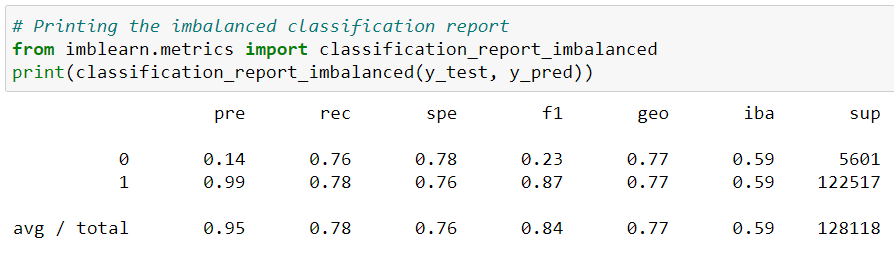
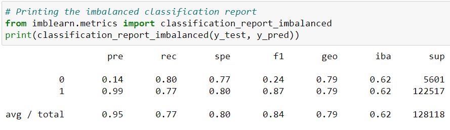
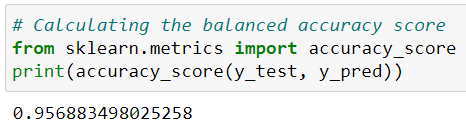
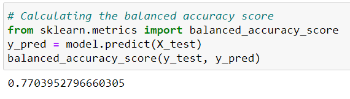
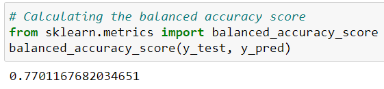

# European_Hotel_Analysis

## Overview of the Logistic Regression, Random Forest, and Easy Ensemble Classifier Machine Learning Models

One of the objectives of the machine learning portion of our project was to predict if hotel reviews provided by customers would either be "positive" or "negative".  We accomplished this by employing different techniques to build and evaluate algorithms/models using resampling.  Afterwards, we compared the predictions/balanced accuracy scores from the various models with each other.  The chosen data from our dataset was first tested with a Simple Logistic Regression algorithm to determine our "first" balanced accuracy score.  This score was then used as a "baseline" to compare with the balanced accuracy scores from the other algorithms.

Oversampling techniques were then used on our chosen data via both the RandomOverSampler and SMOTE algorithms, which was then followed by undersampling techniques on our data using the RandomUnderSampler algorithm.  Finally, a combined sampling approach was performed using the SMOTEENN algorithm.  This was all part of the Logistic Regression machine learning model.

After completing our Logistic Regression we ran two other algorithms, both of which are part of the Ensemble Learners class of algorithms.  These algorithms were BalancedRandomForestClassifier and EasyEnsembleClassifier, both used to predict "positive" or "negative" hotel reviews.  The performances of all the machine learning models were compared with each other to determine if one model was more efficient at predicting than the others.

The following steps were taken to run each of our supervised machine learning models.

1. Create an empty Review_Class column in our data table. 

2. Fill the Review_Class column with either "positive" or "negative" classifications.  (Note: Reviewer_Score column values greater than or equal to 5.0 were coded/classified as "positive" and Reviewer_Score column values less than or equal to 4.9 were coded/classified as "negative")

3. Using label encoding code, label all positive and negative classifications into float values (0 or 1) by converting the string values.

4. Using label encoding code, label all Country classifications into float values (0-5) by converting the string values.

5. Identify the target variable (Review_Class).

6. Disgard all irrelevant columns in our dataset for our machine learning models.  In addition to the Review_Class and Country columns, Average_Score, Review_Total_Negative_Word_Counts, and Review_Total_Positive_Word_Counts were also included in our various machine learning models.

7. Train the model using the training data.

8. Calculate the balanced accuracy score from sklearn.metrics.

9. Print the confusion matrix from sklearn.metrics.

10. Generate a classication report using the `imbalanced_classification_report` from imbalanced-learn.

Initially, only the Review_Class and Country columns were included in the various machine learning models.  The balanced accuracy scores for this round of testing was between 0.50 and 0.66.  The Average_Score, Review_Total_Negative_Word_Counts, and Review_Total_Positive_Word_Counts columns were then added/included into our various machine learning models, and the balanced accuracy scores for this round of testing improved dramatically.  The scores ranged from (0.77 to 0.96).

Including a customers average score, as well as their positive and negative word counts provided the algorithm more information in order to make predictions on whether future reviews would be positive or negative.

## Summary of Chosen Machine Learning Models Results

Listed below are the precision and the recall/sensitivity scores from the 3 machine learning models:  

1) Logistic Regression

Native Random Oversampling: Precision Average = 0.95, Recall/Sensitivity Average = 0.78

SMOTE Oversampling: Precision Average = 0.95, Recall/Sensitivity Average = 0.78

Random Undersampling: Precision Average = 0.95, Recall/Sensitivity Average = 0.78

SMOTEENN Combination: Precision Average = 0.95, Recall/Sensitivity Average = 0.77

2) Random Forest Classifier

BalancedRandomForestClassifier: Precision Average = 0.95, Recall/Sensitivity Average = 0.77

3) Easy Ensemble Classifier

EasyEnsembleClassifier: Precision Average = 0.95, Recall/Sensitivity Average = 0.79

Listed below are the balanced accuracy scores from the 3 machine learning models:

1) Logistic Regression

Simple Logistic Regression: Balanced Accuracy Score = 0.957

Native Random Oversampling: Balanced Accuracy Score = 0.770

SMOTE Oversampling: Balanced Accuracy Score = 0.769

Random Undersampling: Balanced Accuracy Score = 0.770

SMOTEENN Combination: Balanced Accuracy Score = 0.773

2) Random Forest Classifier

BalancedRandomForestClassifier: Balanced Accuracy Score = 0.787

3) Easy Ensemble Classifier

EasyEnsembleClassifier: Balanced Accuracy Score = 0.795

## Summary

To summarize, Logistic Regression, Random Forest, and Easy Ensemble are used to address class imbalance scenarios.  Class imbalance refers to when one class is much larger than another class in a set of data.  In our European Hotel Analysis, class imbalances refer to positive and negative hotel reviews.  Judging by the reviews in our original dataset, there are a far greater number of positive reviews over negative ones.

When looking only at the Balanced Accuracy Scores (not accounting for the Precision Averages and the Recall/Sensitivity Averages), one can see that the highest score belongs to the Simple Logistic Regression algorithm (0.957).  However, when looking at the Precision Averages (0.95), the Recall/Sensitivity Averages (0.79), as well as the high Balanced Accuracy Score (0.795), we would recommend the (Easy Ensemble Classifier) algorithm to use for predicting positive and negative hotel reviews.

Generally speaking, as we moved from logistic regression algorithms to other algorithms such as Random Forest and Easy Ensemble Classifiers the averages and accuracy scores generally increased.  This is not necessarily surprising as Random Forest and Easy Ensemble Classifiers combining different subsets of the minority and majority data.