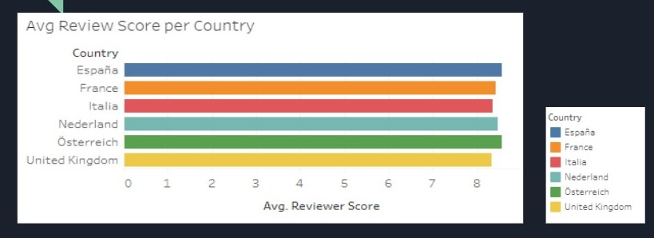
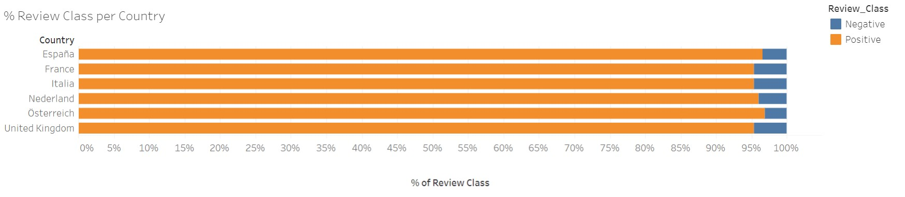
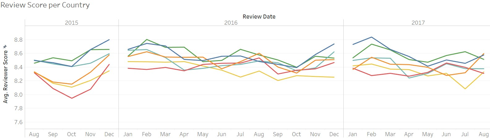
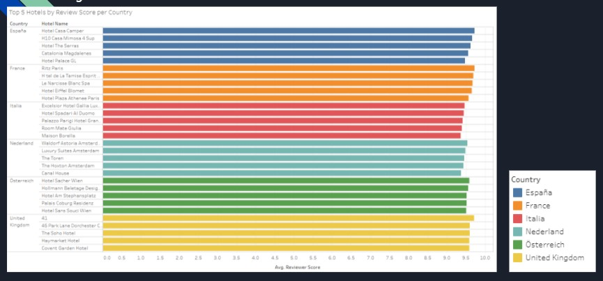
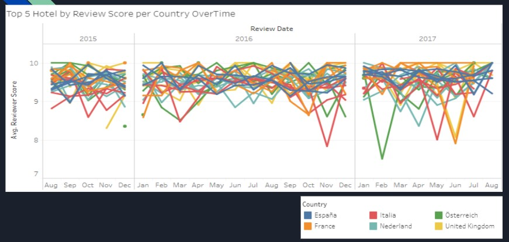
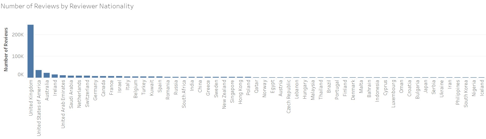
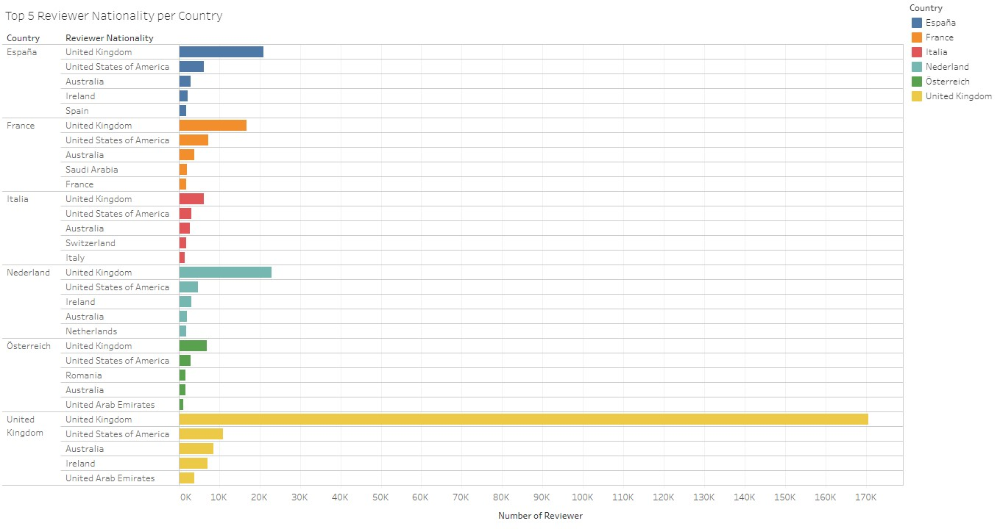
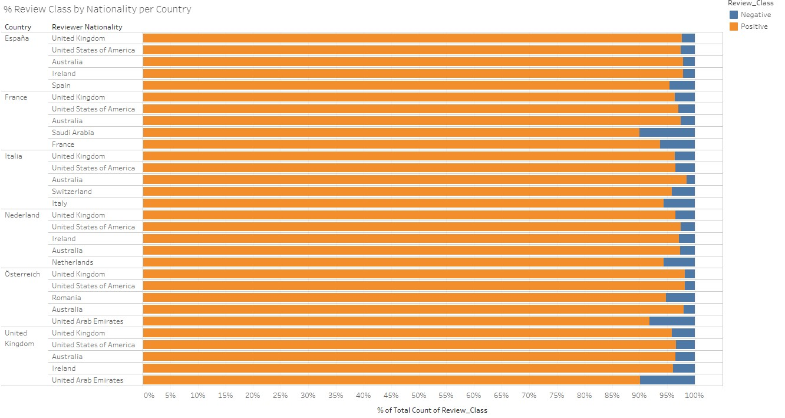
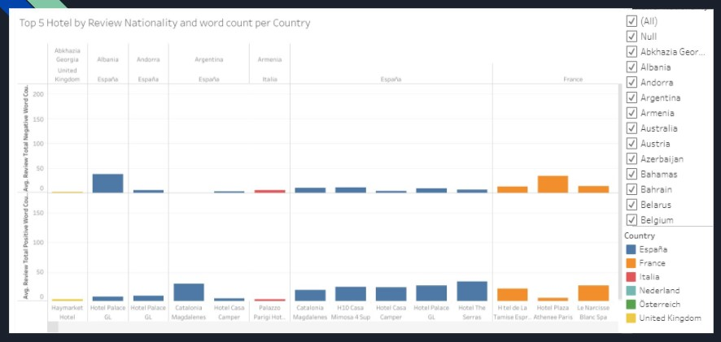

# European Hotel Analysis

## Project Overview
Sally wants to go on vacation. She is thinking about where to go and which hotel should she choose to stay? What are her options? 
1. Choose randomly 
2. Choose based on experience or recommendation of friends and family 
3. Choose based on Hours of Research

The topic we select for our Final Project is a "European Hotel Review Analysis". The objective of our project is to create a web application that can be used by the consumer to find hotels faster and easily, and hotel management can use to improve their performance. Here are the steps that will allow us to achieve our goal: 
1. Create a database and host it on AWS.
2. Run various machine learning models to predict review scoring and compare which machine learning model is most accurate.
3. Create a fully functioning and interactive dashboard using tableau.
4. Create and host a Web application on Github to showcase results. 

Lastly, based on previous class deliverables and group research done by the project team, the dataset presents the best opportunity to showcase skills associated with ETL (Extract, Transfer, and Load), machine learning models, and data visualization.

### Data Source Description
This dataset contains 515,000 customer reviews and a scoring of 1493 luxury hotels across Europe. The geographical location of hotels is also provided. The data was scraped from Booking.com. All data in the file is publicly available to everyone already. Data is originally owned by Booking.com. 

#### Data Content
The CSV file contains 17 fields. The description of each field is as below:
- Hotel_Address: Address of the hotel.
- Review_Date: Date when the reviewer posted the corresponding review.
- Average_Score: Average Score of the hotel, calculated based on the latest comment in the last year.
- Hotel_Name: Name of Hotel
- Reviewer_Nationality: Nationality of Reviewer
- Negative_Review: Negative Review the reviewer gave to the hotel. If the reviewer does not give a negative review, then it should be: 'No Negative'
- ReviewTotalNegativeWordCounts: Total number of words in the negative review.
- Positive_Review: Positive Review the reviewer gave to the hotel. If the reviewer does not give a negative review, then it should be: 'No Positive'
- ReviewTotalPositiveWordCounts: Total number of words in the positive review.
- Reviewer_Score: Score the reviewer has given to the hotel, based on his/her experience
- TotalNumberofReviewsReviewerHasGiven: Number of Reviews the reviewers have given in the past.
- TotalNumberof_Reviews: Total number of valid reviews the hotel has.
- Tags: Tags reviewer gave the hotel.
- dayssincereview: Duration between the review date and scrape date.
- AdditionalNumberof_Scoring: There are also some guests who just made scoring on the service rather than a review. This number indicates how many valid scores without review in there.
- lat: Latitude of the hotel
- lng: longitude of the hotel

### Questions we are trying to answer

- Train and evaluate various machine learning models to determine which selected machine learning model predicts the review score with the highest accuracy.
- What is the Avg Review Score per Country?
- What % are positive reviews and negative reviews per Country?
- Overtime - Did the Avg Reviews score of the Country improved or degraded?  
- What are the Top 5 hotels with the highest review score per Country?
- Overtime - Did the Avg Reviews score of the Top 5 Hotels per Country improved or degraded?
- What is the Number of Reviews per Reviewer Nationality?
- What are the Top 5 Reviewer Nationality per country?
- What % are positive reviews and negative reviews per Top 5 Reviewer Nationality per Country?
- Based on the reviewer's nationality - What are the positive and negative Avg words count per Top 5 Hotels per country?
- What is the recommended hotel per country?

## Results 

### Machine Learning Models
MACHINE LEARNING ALGORITHM		|   ACCURACY SCORE
|---|----|
Simple Logistic Regression				|	0.957		
Logistic Regression with Native Random Oversampling		|	0.770
Logistic Regression with SMOTE Oversampling			|	0.769
Logistic Regression with Random Undersampling		|	0.770
Logistic Regression with SMOTEENN			|	0.773
Random Forest Classifier				|	0.787
Easy Ensemble Classifier				|	0.795
NLP using Pyspark					|	0.920
NLP using Deep Learning (2 layers)				|	0.957

### Tableau Analysis 
#### What is the Avg Review Score per Country?

> 

#### What % are positive reviews and negative reviews per Country?
> 

#### Overtime - Did the Avg Reviews score of the Country improved or degraded?  
> 

#### What are the Top 5 hotels with the highest review score per Country?
> 

#### Overtime - Did the Avg Reviews score of the Top 5 Hotels per Country improved or degraded?
> 

#### What is the Number of Reviews per Reviewer Nationality?
> 

#### What are the Top 5 Reviewer Nationality per country?
> 

#### What % are positive reviews and negative reviews per Top 5 Reviewer Nationality per Country?
> 

#### Based on the reviewer's nationality - What are the positive and negative Avg words count per Top 5 Hotels per country?
> 

## Recommendations
### Machine Learning Models
1. If the company wants to have the review results in two categories - 'positive' and 'negative', then Logistic Regression and Deep Learning NLP are recommended - both have an accuracy score of 0.957.
2. If the company wants any further granularity in the review output, then PySpark NLP is recommended.
3. If a balance between granularity and accuracy is desired, then the 3 categories (good, bad, average) review output is suggested. These categories are easy for customers to understand. PySpark NLP is recommended as the model - it gives an accuracy score of 0.786.

### Best Hotel per Country 
1. España/Spain: Hotel Casa Camper
2. France: Ritz Paris
3. Italia/Italy: Excelsior Hotel Gallia Luxury Collection Hotel
4. Nederland/Netherlands: Waldorf Astoria Amsterdam
5. Österreich/Austria: Hotel Sacher Wien
6. United Kingdom: 41

## Resources 
[Website](https://jagpreetbath.github.io/European_Hotel_Analysis/index.html)

[Google Slides](https://docs.google.com/presentation/d/18UyDqehfuOY-jSQNCMsIw5Z9MuEUVRClHHr3JhimY5A/edit?usp=sharing)

[Tableau Workbook](https://public.tableau.com/profile/jagpreet.bath#!/vizhome/European_Hotel_Analysis/Country)

[Data Source](https://www.kaggle.com/jiashenliu/515k-hotel-reviews-data-in-europe)

[Web Application Template](https://www.creative-tim.com/new-issue/black-dashboard)

[Machine Learning](https://github.com/JagpreetBath/European_Hotel_Analysis/tree/main/MachineLearning)

[Entity Relationship Diagram](https://github.com/JagpreetBath/European_Hotel_Analysis/blob/main/DataBase/PostgresSQL/ERD_and_Schema/DB_ERD.png)

[Database Schema](https://github.com/JagpreetBath/European_Hotel_Analysis/blob/main/DataBase/PostgresSQL/ERD_and_Schema/DB_Schema.sql)

[Sample Hotel Reviews Data ](https://github.com/JagpreetBath/European_Hotel_Analysis/blob/main/DataFiles/TransformedData/tables/sample_of_hotel_reviews.zip)

[Sample Hotel Location Data ](https://github.com/JagpreetBath/European_Hotel_Analysis/blob/main/DataFiles/TransformedData/tables/sample_of_hotel_location.zip)

[PostgreSQL Table (Hotel Location) Image](https://github.com/JagpreetBath/European_Hotel_Analysis/blob/main/DataBase/PostgresSQL/Sample_hotel_location.png)

[PostgreSQL Table (Hotel Reviews) Image](https://github.com/JagpreetBath/European_Hotel_Analysis/blob/main/DataBase/PostgresSQL/Sample_hotel_reviews.png)

[Connection of PySpark NLP ML model to the database](https://github.com/JagpreetBath/European_Hotel_Analysis/blob/main/MachineLearning/ML_NLP_PySpark/Step12_Final_PySpark_NLP_reading_from_RDS.ipynb)

[Connection of DeepLearning NLP ML model to the database](https://github.com/JagpreetBath/European_Hotel_Analysis/blob/main/MachineLearning/ML_NLP_DeepLearning/Step5_NLP_DL_Review_Pos_Neg_Format.ipynb)
